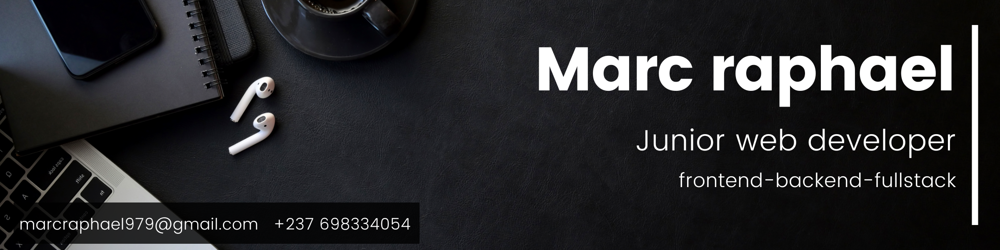

    

### Hi 👋
I am Marc raphael! Frontend Developer.
- 👨🏽‍💻 Currently working on Ruby and RoR projects.
- 🤝 Open for collaborations in algorithmes and web development.
- Always available for new opportunities
<!-- 🌐 Take a loot at my [porfolio website](https://portofolio.marcraphael.repl.co/) to learn more about myself.-->

    
   

⭐ From [Marc Raphael](https://github.com/Marcraphael12)
