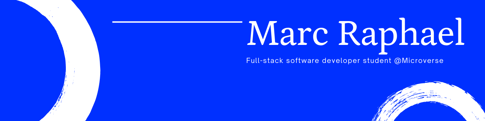

   

### Hi 👋
I am Marc raphael! I am working on projects related to web development.
- 👨🏽‍💻 Currently working on React&Redux projects.
- 🤝 Looking for collaborations in algorithmes and web development.
- Always available for new opportunities
- 🌐 Take a loot at my [porfolio website](https://portofolio.marcraphael.repl.co/) to learn more about myself.

  

<!---->

⭐ From [Marc Raphael](https://github.com/Marcraphael12)
